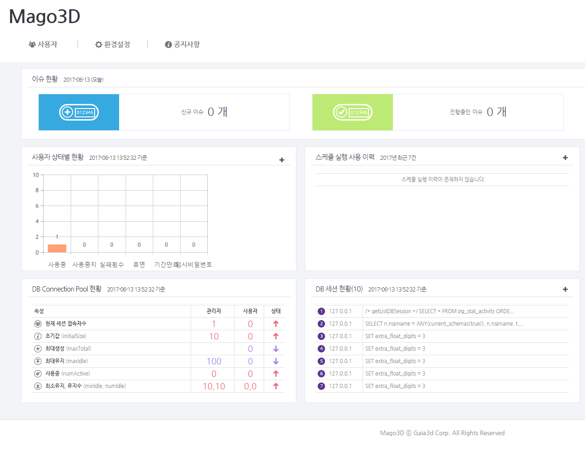

통합 과제 & 이슈 관리 시스템

### Mission
Mago3DJS 3차원 다중 블록 가시화를 위한 오픈소스 자바스크립트 라이브러리를 사용한 가시화 데이터를 통합 과제 & 이슈 관리를 할 수 있습니다.

### Development Environment
#### Framework
 - [Spring](https://spring.io/) 사용하여...
 - Spring Boot

#### UI
 - [AXISJ](https://axisj.com) 자바스크립트 기반 UI Framework로 강력한 UI 기능 제공

#### DataBase
- [PostgreSQL](https://www.postgresql.org/download/)
     - PostgreSQL 버전 설정 (PostgreSQL v9.6.3-1)
     - 설치경로 C:/PostgreSQL
     - 비밀번호 설정 Password: postgres Retype Password : postgres

- [PostGIS](http://www.postgis.net/windows_downloads/)
   - PostgreSQL 설치가 끝난 뒤에 Stack Builder를 실행하여 설치
   - PostGIS 버전 설정 (PostGIS v2.3.2)

#### Build
- [gradle](https://gradle.org/releases)
  - gradle 버전 설치 (gradle v3.5)
  - 설치경로 C:/gradle
  - 시스템 변수 추가 -path -> C:\gradle\gradle-3.5 추가

#### eclipse
 - [lombok](https://projectlombok.org/) 설치
 - Eclipse Marketplace에서 Buildship Gradle Integration 2.0 설치

### License
...

 tar xvzf postgis-2.3.2.tar.gz 
 cd postgis-2.3.2 
 ./configure 
 make 
 make install
 
 
CREATE EXTENSION postgis;
CREATE EXTENSION address_standardizer;
CREATE EXTENSION fuzzystrmatch;
CREATE EXTENSION postgis_topology;
CREATE EXTENSION postgis_tiger_geocoder;

CREATE EXTENSION pgrouting;

CREATE EXTENSION postgis_sfcgal;
ALTER DATABASE your_db_here SET postgis.backend = sfcgal;
 
 
 